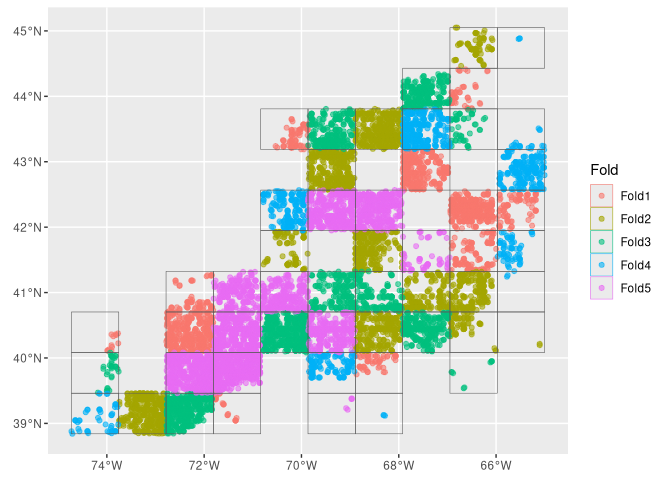
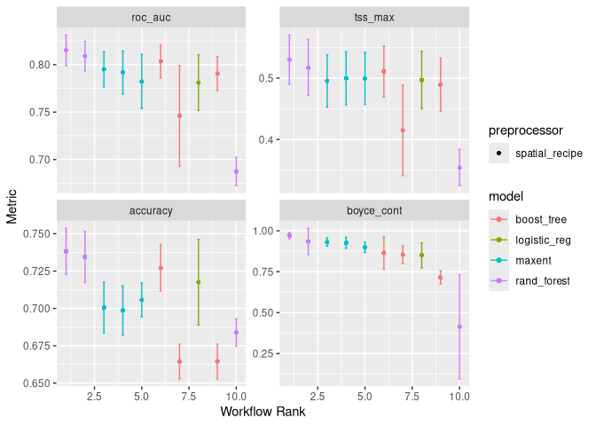
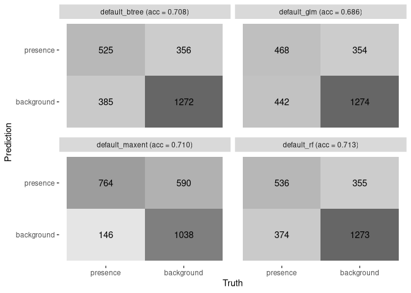
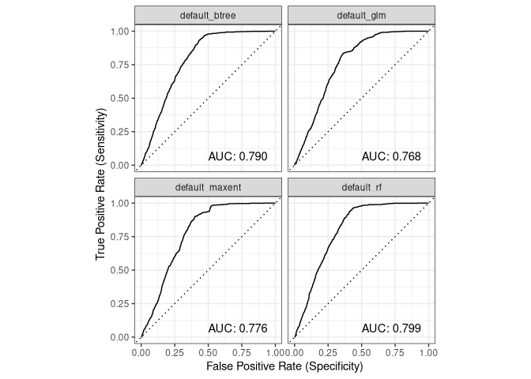
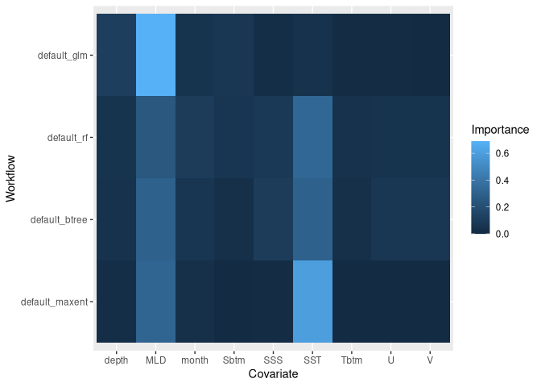
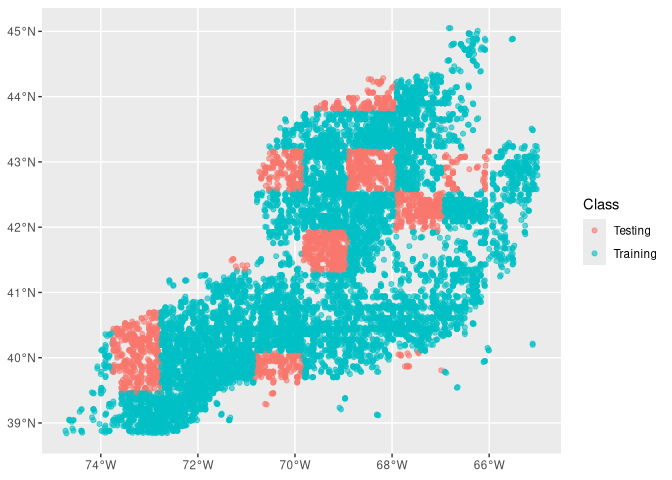
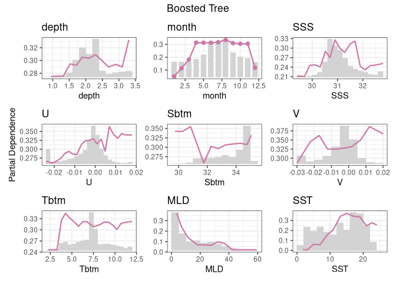

C04_assigment
================

``` r
cfg = read_configuration(scientificname = "Lophius americanus", version = "v1")

model_input = read_model_input(
  scientificname = "Lophius americanus",
  version = "v1",
  log_me = c("depth", "Xbtm")
) |>
  dplyr::mutate(month = month_as_number(.data$month)) |>
  select(all_of(c("class", cfg$keep)))
```

``` r
model_input_split = spatial_initial_split(
  model_input,
  prop = 1 / 5,
  strategy = spatial_block_cv
)
model_input_split
```

    ## <Training/Testing/Total>
    ## <11613/2538/14151>

``` r
autoplot(model_input_split)
```

<!-- -->

``` r
tr_data = training(model_input_split)

cv_tr_data <- spatial_block_cv(
  tr_data,
  v = 5,
  cellsize = grid_cellsize(model_input),
  offset = grid_offset(model_input) + 0.00001
)

autoplot(cv_tr_data)
```

<!-- -->

``` r
one_row_of_training_data = dplyr::slice(tr_data, 1)
rec = recipe(one_row_of_training_data, formula = class ~ .)
rec
```

    ## 

    ## ── Recipe ──────────────────────────────────────────────────────────────────────

    ## 

    ## ── Inputs

    ## Number of variables by role

    ## outcome:   1
    ## predictor: 9
    ## coords:    2

``` r
summary(rec)
```

    ## # A tibble: 12 × 4
    ##    variable type      role      source  
    ##    <chr>    <list>    <chr>     <chr>   
    ##  1 depth    <chr [2]> predictor original
    ##  2 month    <chr [2]> predictor original
    ##  3 SSS      <chr [2]> predictor original
    ##  4 U        <chr [2]> predictor original
    ##  5 Sbtm     <chr [2]> predictor original
    ##  6 V        <chr [2]> predictor original
    ##  7 Tbtm     <chr [2]> predictor original
    ##  8 MLD      <chr [2]> predictor original
    ##  9 SST      <chr [2]> predictor original
    ## 10 X        <chr [2]> coords    original
    ## 11 Y        <chr [2]> coords    original
    ## 12 class    <chr [3]> outcome   original

``` r
wflow = workflow_set(
  preproc = list(default = rec),
  models = list(
    glm = logistic_reg(mode = "classification") |>
      set_engine("glm"),

    rf = rand_forest(
      mtry = tune(),
      trees = tune(),
      mode = "classification"
    ) |>
      set_engine("ranger", importance = "impurity"),

    btree = boost_tree(
      mtry = tune(),
      trees = tune(),
      tree_depth = tune(),
      learn_rate = tune(),
      loss_reduction = tune(),
      stop_iter = tune(),
      mode = "classification"
    ) |>
      set_engine("xgboost"),

    maxent = maxent(
      feature_classes = tune(),
      regularization_multiplier = tune(),
      mode = "classification"
    ) |>
      set_engine("maxnet")
  )
)
wflow
```

    ## # A workflow set/tibble: 4 × 4
    ##   wflow_id       info             option    result    
    ##   <chr>          <list>           <list>    <list>    
    ## 1 default_glm    <tibble [1 × 4]> <opts[0]> <list [0]>
    ## 2 default_rf     <tibble [1 × 4]> <opts[0]> <list [0]>
    ## 3 default_btree  <tibble [1 × 4]> <opts[0]> <list [0]>
    ## 4 default_maxent <tibble [1 × 4]> <opts[0]> <list [0]>

``` r
metrics = sdm_metric_set(yardstick::accuracy)
metrics
```

    ## A metric set, consisting of:
    ## - `boyce_cont()`, a probability metric | direction: maximize
    ## - `roc_auc()`, a probability metric    | direction: maximize
    ## - `tss_max()`, a probability metric    | direction: maximize
    ## - `accuracy()`, a class metric         | direction: maximize

``` r
wflow <- wflow |>
  workflow_map(
    "tune_grid",
    resamples = cv_tr_data,
    grid = 3,
    metrics = metrics,
    verbose = TRUE
  )
```

    ## i    No tuning parameters. `fit_resamples()` will be attempted

    ## i 1 of 4 resampling: default_glm

    ## ✔ 1 of 4 resampling: default_glm (1.2s)

    ## i 2 of 4 tuning:     default_rf

    ## i Creating pre-processing data to finalize 1 unknown parameter: "mtry"

    ## ✔ 2 of 4 tuning:     default_rf (6m 41.5s)

    ## i 3 of 4 tuning:     default_btree

    ## i Creating pre-processing data to finalize 1 unknown parameter: "mtry"

    ## → A | warning: `early_stop` was reduced to 0.

    ## There were issues with some computations   A: x1There were issues with some computations   A: x2There were issues with some computations   A: x3There were issues with some computations   A: x4There were issues with some computations   A: x5There were issues with some computations   A: x5
    ## ✔ 3 of 4 tuning:     default_btree (1m 26.9s)
    ## i 4 of 4 tuning:     default_maxent
    ## ✔ 4 of 4 tuning:     default_maxent (7.2s)

``` r
autoplot(wflow)
```

<!-- -->

``` r
model_fits = workflowset_selectomatic(
  wflow,
  model_input_split,
  filename = "Lophius_americanus-v1-model_fits",
  path = data_path("models")
)
model_fits
```

    ## # A tibble: 4 × 7
    ##   wflow_id  splits               id    .metrics .notes   .predictions .workflow 
    ##   <chr>     <list>               <chr> <list>   <list>   <list>       <list>    
    ## 1 default_… <split [11613/2538]> trai… <tibble> <tibble> <tibble>     <workflow>
    ## 2 default_… <split [11613/2538]> trai… <tibble> <tibble> <tibble>     <workflow>
    ## 3 default_… <split [11613/2538]> trai… <tibble> <tibble> <tibble>     <workflow>
    ## 4 default_… <split [11613/2538]> trai… <tibble> <tibble> <tibble>     <workflow>

``` r
model_fit_metrics(model_fits)
```

    ## # A tibble: 4 × 5
    ##   wflow_id       accuracy boyce_cont roc_auc tss_max
    ##   <chr>             <dbl>      <dbl>   <dbl>   <dbl>
    ## 1 default_glm       0.686      0.794   0.768   0.472
    ## 2 default_rf        0.713      0.910   0.799   0.528
    ## 3 default_btree     0.708      0.882   0.790   0.500
    ## 4 default_maxent    0.710      0.921   0.776   0.499

``` r
model_fit_confmat(model_fits)
```

<!-- -->

``` r
model_fit_roc_auc(model_fits)
```

<!-- -->

``` r
model_fit_varimp_plot(model_fits)
```

<!-- -->

``` r
rf = model_fits |>
  filter(wflow_id == "default_rf")
rf
```

    ## # A tibble: 1 × 7
    ##   wflow_id  splits               id    .metrics .notes   .predictions .workflow 
    ##   <chr>     <list>               <chr> <list>   <list>   <list>       <list>    
    ## 1 default_… <split [11613/2538]> trai… <tibble> <tibble> <tibble>     <workflow>

``` r
autoplot(rf$splits[[1]])
```

<!-- -->

``` r
rf$.metrics[[1]]
```

    ## # A tibble: 4 × 4
    ##   .metric    .estimator .estimate .config        
    ##   <chr>      <chr>          <dbl> <chr>          
    ## 1 accuracy   binary         0.713 pre0_mod0_post0
    ## 2 boyce_cont binary         0.910 pre0_mod0_post0
    ## 3 roc_auc    binary         0.799 pre0_mod0_post0
    ## 4 tss_max    binary         0.528 pre0_mod0_post0

``` r
rf$.predictions[[1]]
```

    ## # A tibble: 2,538 × 6
    ##    class      .pred_class .pred_presence .pred_background  .row .config        
    ##    <fct>      <fct>                <dbl>            <dbl> <int> <chr>          
    ##  1 presence   background         0.0533             0.947     1 pre0_mod0_post0
    ##  2 background background         0.00420            0.996    25 pre0_mod0_post0
    ##  3 background background         0.00525            0.995    36 pre0_mod0_post0
    ##  4 background background         0.0191             0.981    39 pre0_mod0_post0
    ##  5 background background         0.0102             0.990    41 pre0_mod0_post0
    ##  6 background background         0.00212            0.998    42 pre0_mod0_post0
    ##  7 background background         0.00603            0.994    45 pre0_mod0_post0
    ##  8 background background         0.00406            0.996    48 pre0_mod0_post0
    ##  9 background background         0.00951            0.990    49 pre0_mod0_post0
    ## 10 background background         0.0185             0.981    52 pre0_mod0_post0
    ## # ℹ 2,528 more rows

``` r
rf$.workflow[[1]]
```

    ## ══ Workflow [trained] ══════════════════════════════════════════════════════════
    ## Preprocessor: Recipe
    ## Model: rand_forest()
    ## 
    ## ── Preprocessor ────────────────────────────────────────────────────────────────
    ## 0 Recipe Steps
    ## 
    ## ── Model ───────────────────────────────────────────────────────────────────────
    ## Ranger result
    ## 
    ## Call:
    ##  ranger::ranger(x = maybe_data_frame(x), y = y, mtry = min_cols(~1L,      x), num.trees = ~2000L, importance = ~"impurity", num.threads = 1,      verbose = FALSE, seed = sample.int(10^5, 1), probability = TRUE) 
    ## 
    ## Type:                             Probability estimation 
    ## Number of trees:                  2000 
    ## Sample size:                      11613 
    ## Number of independent variables:  9 
    ## Mtry:                             1 
    ## Target node size:                 10 
    ## Variable importance mode:         impurity 
    ## Splitrule:                        gini 
    ## OOB prediction error (Brier s.):  0.196355

``` r
model_fit_pdp(
  model_fits,
  wid = "default_btree",
  title = "Boosted Tree"
)
```

<!-- -->
