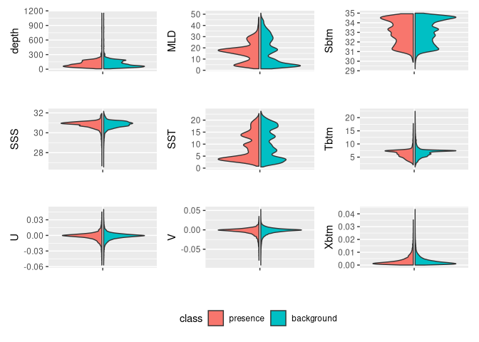

My Second Species
================

## GitHub Documents

This is an R Markdown format used for publishing markdown documents to
GitHub. When you click the **Knit** button all R code chunks are run and
a markdown file (.md) suitable for publishing to GitHub is generated.

## Including Code

You can include R code in the document as follows:

``` r
model_input = read_model_input(
  scientificname = "Gadus_morhua"
)

model_input
```

    ## Simple feature collection with 31323 features and 2 fields
    ## Geometry type: POINT
    ## Dimension:     XY
    ## Bounding box:  xmin: -74.6449 ymin: 38.85 xmax: -65 ymax: 45.15
    ## Geodetic CRS:  WGS 84
    ## # A tibble: 31,323 × 3
    ##    month class                    geom
    ##    <fct> <fct>             <POINT [°]>
    ##  1 Jan   presence     (-65.06667 43.1)
    ##  2 Jan   presence (-65.78333 43.01667)
    ##  3 Jan   presence    (-73.45 40.48333)
    ##  4 Jan   presence     (-65.2 43.36667)
    ##  5 Jan   presence     (-65.11667 42.7)
    ##  6 Jan   presence    (-69.75 40.58333)
    ##  7 Jan   presence (-71.18333 40.93333)
    ##  8 Jan   presence     (-65.9 42.58333)
    ##  9 Jan   presence (-70.93333 41.28333)
    ## 10 Jan   presence (-73.21667 40.53333)
    ## # ℹ 31,313 more rows

``` r
db = brickman_database() |>
  dplyr::filter(
    scenario == "PRESENT",
    interval == "mon"
  )
present = read_brickman(db, add = "depth")
```

``` r
keep = filter_collinear(present, method = "cor_caret", cutoff = 0.65)
keep
```

    ## [1] "SSS"  "Sbtm" "Tbtm" "U"    "V"    "MLD"  "SST" 
    ## attr(,"to_remove")
    ## [1] "depth" "Xbtm"

``` r
keep = c("depth","month",keep)
keep
```

    ## [1] "depth" "month" "SSS"   "Sbtm"  "Tbtm"  "U"     "V"     "MLD"   "SST"

``` r
present_env = present |>
  dplyr::select(where(is.numeric))


variables = extract_brickman(
  present,
  model_input,
  form = "wide"
)
variables
```

    ## Simple feature collection with 31323 features and 12 fields
    ## Geometry type: POINT
    ## Dimension:     XY
    ## Bounding box:  xmin: -74.6449 ymin: 38.85 xmax: -65 ymax: 45.15
    ## Geodetic CRS:  WGS 84
    ## # A tibble: 31,323 × 13
    ##    .id    month class    depth   MLD  Sbtm   SSS   SST  Tbtm        U         V
    ##    <chr>  <fct> <fct>    <dbl> <dbl> <dbl> <dbl> <dbl> <dbl>    <dbl>     <dbl>
    ##  1 p00001 Jan   presence 135.   31.0  33.3  30.1  3.07  5.22 -0.0173  -0.00476 
    ##  2 p00002 Jan   presence 131.   29.9  33.2  30.2  3.45  5.24 -0.0133  -0.00513 
    ##  3 p00003 Jan   presence  24.8  24.0  31.6  31.6  5.04  5.06  0.00733 -0.00157 
    ##  4 p00004 Jan   presence  94.5  31.5  32.5  30.3  3.38  4.58 -0.00492 -0.0101  
    ##  5 p00005 Jan   presence 100.   20.5  33.6  30.4  3.59  6.37 -0.0111  -0.00411 
    ##  6 p00006 Jan   presence  59.7  44.2  31.5  31.2  5.42  5.72 -0.0453  -0.0156  
    ##  7 p00007 Jan   presence  54.0  46.2  31.6  31.4  6.22  6.79 -0.00361 -0.000982
    ##  8 p00008 Jan   presence 118.   20.3  33.9  30.4  3.80  7.18 -0.0140  -0.000398
    ##  9 p00009 Jan   presence  31.9  28.4  31.2  31.1  5.07  5.17  0.0102  -0.0102  
    ## 10 p00010 Jan   presence  24.9  23.5  31.6  31.6  4.87  4.91  0.00621  0.00221 
    ## # ℹ 31,313 more rows
    ## # ℹ 2 more variables: Xbtm <dbl>, geom <POINT [°]>

``` r
variables = variables |>
  mutate(class = model_input$class) |>    # the $ extracts a column 
  select(-.id)                            # the minus means "deselect" or "drop"
variables
```

    ## Simple feature collection with 31323 features and 11 fields
    ## Geometry type: POINT
    ## Dimension:     XY
    ## Bounding box:  xmin: -74.6449 ymin: 38.85 xmax: -65 ymax: 45.15
    ## Geodetic CRS:  WGS 84
    ## # A tibble: 31,323 × 12
    ##    month class    depth   MLD  Sbtm   SSS   SST  Tbtm        U         V    Xbtm
    ##    <fct> <fct>    <dbl> <dbl> <dbl> <dbl> <dbl> <dbl>    <dbl>     <dbl>   <dbl>
    ##  1 Jan   presence 135.   31.0  33.3  30.1  3.07  5.22 -0.0173  -0.00476  0.00646
    ##  2 Jan   presence 131.   29.9  33.2  30.2  3.45  5.24 -0.0133  -0.00513  0.00509
    ##  3 Jan   presence  24.8  24.0  31.6  31.6  5.04  5.06  0.00733 -0.00157  0.00266
    ##  4 Jan   presence  94.5  31.5  32.5  30.3  3.38  4.58 -0.00492 -0.0101   0.00401
    ##  5 Jan   presence 100.   20.5  33.6  30.4  3.59  6.37 -0.0111  -0.00411  0.00421
    ##  6 Jan   presence  59.7  44.2  31.5  31.2  5.42  5.72 -0.0453  -0.0156   0.0189 
    ##  7 Jan   presence  54.0  46.2  31.6  31.4  6.22  6.79 -0.00361 -0.000982 0.00133
    ##  8 Jan   presence 118.   20.3  33.9  30.4  3.80  7.18 -0.0140  -0.000398 0.00502
    ##  9 Jan   presence  31.9  28.4  31.2  31.1  5.07  5.17  0.0102  -0.0102   0.00517
    ## 10 Jan   presence  24.9  23.5  31.6  31.6  4.87  4.91  0.00621  0.00221  0.00234
    ## # ℹ 31,313 more rows
    ## # ℹ 1 more variable: geom <POINT [°]>

``` r
plot_pres_vs_bg(
  variables |> dplyr::select(-month),
  "class"
)
```

<!-- -->

``` r
cfg = list(
  version = "v1",
  scientificname = "Gadus morhua",
  background = "average of observations per month",
  keep_vars = keep
)

cfg
```

    ## $version
    ## [1] "v1"
    ## 
    ## $scientificname
    ## [1] "Gadus morhua"
    ## 
    ## $background
    ## [1] "average of observations per month"
    ## 
    ## $keep_vars
    ## [1] "depth" "month" "SSS"   "Sbtm"  "Tbtm"  "U"     "V"     "MLD"   "SST"

``` r
make_path(data_path("models"))
```

    ## [1] "~/ColbyForecasting_data/models"

``` r
write_configuration(cfg)

write_model_input(
  variables,
  scientificname = "Gadus morhua",
  version = "v1"
)
```
